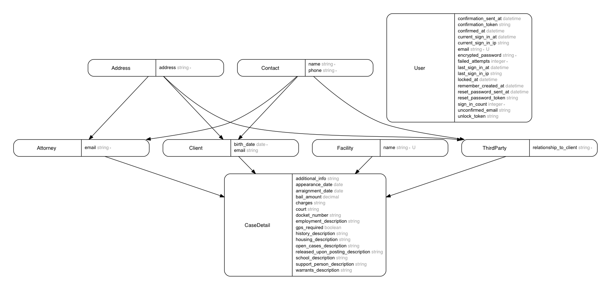

  

# Mass Bail Fund

The [Massachusetts Bail Fund](https://www.massbailfund.org/) is committed to the harm reduction of freeing individuals serving pre-trial sentences, and to abolishing pre-trial detention and supervision in the long-term. We pay up to $500 bail so that low-income people can stay free while they work towards resolving their case, allowing individuals, families, and communities to stay productive, together, and stable.

This site is the code for the administrative back end of the bail fund. If you are interested in contributing to the code, welcome! Take a look at the contribution guidelines below. If you work or volunteer with another bail fund and would like help adapting this code for your own organization, let us know by opening an issue! We're happy to help.

## Contribution Guidelines

Anyone at any experience level who wants to contribute is welcome! We have [open tickets to work on here](https://github.com/MassBailFund/MassBailFund/issues), and have tagged ones that we think would be good tickets to start with as `good-first-ticket`.

Once you have cloned down the repo and gotten everything working locally, the flow would be to create a new feature branch for your issue, write tests covering any new code, and make a pull request. We'll try to review them in a timely fashion, but feel free to tag the current maintainer (RSid) if you've waited more than 2 weeks for a response.

## Setup
1. Clone down repo
1. Download and install mysql
1. Download and install node (execjs depends on it)
1. I'd advise using a ruby version manager such as chruby, and make sure that you're using >= ruby 2.3. Run `bundle install`.
1. Run `MA_BAIL_USER_PASSWORD=[your desired user password here] rails db:reset` You may also wish to alter the username associated with that user in seed.rb.
1. Check to see that all tests are passing with `rspec spec`.
1. Run the site with `rails s`, then go to localhost:3000 to see if it works!

## Important Dependencies

Tool                | Description
------------------- | -----------
[Rails]             | Batteries included web application framework
[Devise]            | Powerful user authentication/activation/password resets
[CanCanCan]         | Define abilities for users in one place
[PaperTrail]        | Keeps a history of model changes
[SimpleForm]        | A Rails form builder plugin

[Rails]: https://github.com/rails/rails
[Devise]: https://github.com/plataformatec/devise
[CanCanCan]: https://github.com/CanCanCommunity/cancancan
[PaperTrail]: https://github.com/airblade/paper_trail
[SimpleForm]: https://github.com/plataformatec/simple_form

### Important Development Dependencies

Tool                | Description
------------------- | -----------
[FactoryBot]        | Easily create models to test with
[Faker]             | Generate realistic looking fake data

[FactoryBot]: https://github.com/thoughtbot/factory_bot
[Faker]: https://github.com/stympy/faker

## Models [TODO: update]

(To update this image after the schema changes run `bundle exec erd`)

The models are currently a work in progress. We are waiting to look at the
current schema before making decisions on how to model things.

## Deployment

We are currently using Heroku to deploy. Heroku's [docs on getting set up are pretty thorough, and are located here](https://devcenter.heroku.com/articles/git).

You will need to take a couple of extra steps if this is your first time provisioning and deploying to a new environment. The dummy user the app's initialized with will draw its password from an environment variable `MA_BAIL_USER_PASSWORD`. You'll also need to install the cleardb add-on [here](https://devcenter.heroku.com/articles/cleardb) in order to use MySQL, and follow the instructions for the mysql2 gem in order to get your database url. Then, you'll need to make an environment variable with that as the value and the key `DATABASE_URL`. You will also, if this is a first deployment, want to run rake db:migrate and rake db:seed to populate dropdowns, etc.
